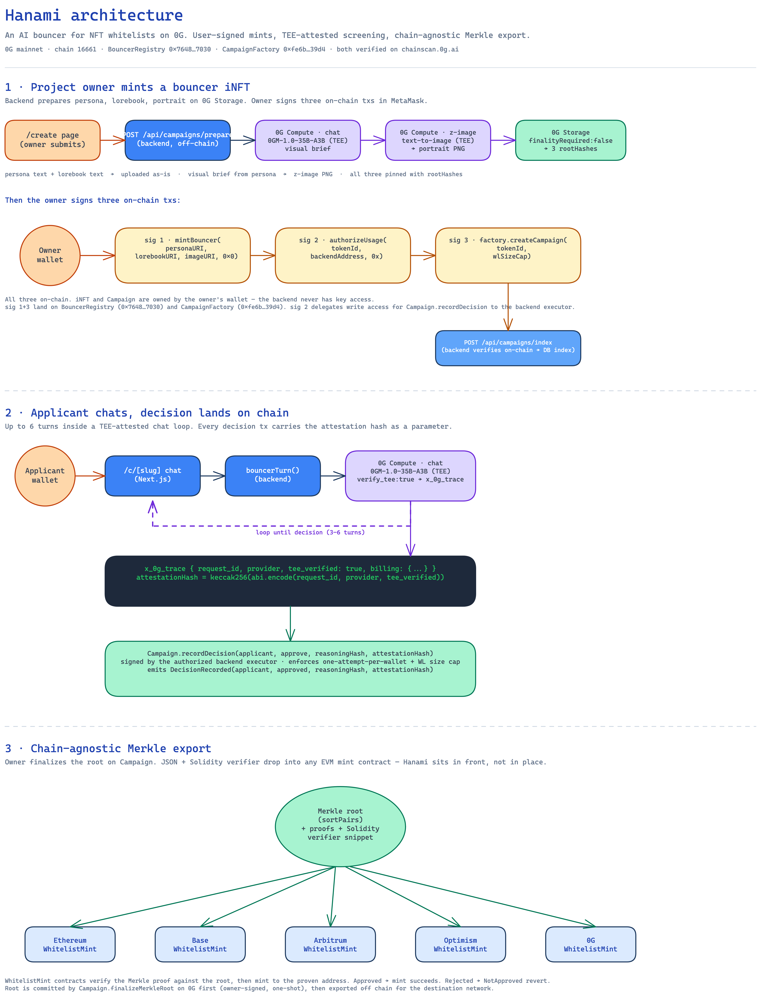

# Hanami · 花見

An AI bouncer for your NFT whitelist. Each bouncer is an ERC-7857 iNFT you own. It interviews each applicant inside a TEE on 0G Compute, signs every decision with a TEE attestation hash on 0G Chain, and exports a Merkle root you can drop into any EVM mint contract.

The whole point: projects can't hand-screen 4,400 applicants for 200 spots. Forms get gamed in an afternoon. Captchas get solved by mechanical-turk farms. Hanami runs the first pass (a private conversation with a character your project defines), and the founders only have to review borderline cases.

## Project overview

A project owner:

1. Mints a bouncer iNFT and writes that bouncer's persona (voice, taste, what makes a fit). Adds an optional project context document the bouncer can reference.
2. Shares the applicant URL.

An applicant connects a wallet, the bouncer greets them in character, they talk for 3–6 turns. The bouncer issues approve or reject. Decision + reasoning are written on chain with the TEE attestation hash that proves the inference ran inside a sealed enclave.

At campaign close, the owner exports a Merkle root and copy-paste-ready Solidity. That root drops into the project's existing mint contract on Ethereum, Base, Arbitrum, OP, or 0G itself. Hanami does not require the mint to happen on 0G.

The MVP ships with two demo bouncers. Both their persona documents, lorebooks, and AI-generated portraits live on 0G Storage. Both iNFTs live on 0G Chain. Both can be inspected on Chainscan.

## Live on 0G mainnet · chain 16661

| Contract | Address |
|---|---|
| BouncerRegistry (ERC-7857 iNFT) | [`0x764883319e51e46F683aB54D93F26bcBb74A7030`](https://chainscan.0g.ai/address/0x764883319e51e46F683aB54D93F26bcBb74A7030) |
| CampaignFactory | [`0xfe6b2417407595Ad4d1F8D4D8c95860881d539d4`](https://chainscan.0g.ai/address/0xfe6b2417407595Ad4d1F8D4D8c95860881d539d4) |

Both verified on `chainscan.0g.ai`. Each project's bouncer iNFT is minted directly to the project owner's wallet. Hanami never custodies the token.

## System architecture



The editable Excalidraw source lives at [`docs/architecture.excalidraw`](docs/architecture.excalidraw). Drop it into [excalidraw.com](https://excalidraw.com) (File > Open) to tweak it. The text version below mirrors the same flow for quick reading inline.

```
            ┌─────────────────────────────┐
            │  /create (Next.js)          │
            │  project owner connects     │
            └──────────────┬──────────────┘
                           │ persona + project context
            ┌──────────────▼──────────────┐
            │  POST /api/campaigns/prepare│  backend uploads to 0G Storage,
            │  (backend, off-chain)       │  generates portrait, returns URIs
            └──────────────┬──────────────┘
                           │
            ┌──────────────▼──────────────┐
            │  0G Compute · 0GM-1.0-35B   │  visual brief from persona text
            │  (TEE-attested chat)        │
            └──────────────┬──────────────┘
                           │
            ┌──────────────▼──────────────┐
            │  0G Compute · z-image       │  portrait PNG
            │  (TEE-attested image)       │
            └──────────────┬──────────────┘
                           │
            ┌──────────────▼──────────────┐
            │  0G Storage                 │  persona, lorebook, portrait
            │  finalityRequired:false     │  → three rootHashes
            └──────────────┬──────────────┘
                           │ owner signs three txs in MetaMask:
                           │
            ┌──────────────▼──────────────┐
            │  BouncerRegistry            │  mintBouncer(personaURI,
            │  ERC-7857 iNFT              │     lorebookURI, imageURI, 0x0)
            └──────────────┬──────────────┘
                           │
            ┌──────────────▼──────────────┐
            │  BouncerRegistry            │  authorizeUsage(tokenId,
            │  delegation                 │     backendAddress, 0x)
            └──────────────┬──────────────┘
                           │
            ┌──────────────▼──────────────┐
            │  CampaignFactory            │  createCampaign(tokenId, cap)
            │  (factory deploys Campaign) │
            └──────────────┬──────────────┘
                           │
            ┌──────────────▼──────────────┐
            │  POST /api/campaigns/index  │  backend verifies on-chain
            │  (DB write only)            │  ownerOf + isAuthorized, then
            │                             │  writes index row for the UI
            └──────────────┬──────────────┘
                           │
                  ─────  applicant arrives  ─────
                           │
            ┌──────────────▼──────────────┐
            │  /c/[slug] chat (Next.js)   │  bouncer greets in character
            └──────────────┬──────────────┘
                           │ per turn
            ┌──────────────▼──────────────┐
            │  0G Compute · 0GM-1.0-35B   │  verify_tee:true
            │  (TEE-attested chat)        │  → x_0g_trace with attestation
            └──────────────┬──────────────┘
                           │ attestationHash =
                           │ keccak256(requestId, provider, tee_verified)
            ┌──────────────▼──────────────┐
            │  Campaign.recordDecision    │  backend (authorized executor)
            │  signs on chain             │  writes each decision tx
            └──────────────┬──────────────┘
                           │ campaign close
            ┌──────────────▼──────────────┐
            │  Merkle root (sortPairs)    │  exports JSON + Solidity snippet
            │  → any EVM mint contract    │
            └─────────────────────────────┘
```

The mint is user-signed. Three signatures from the project owner (mint, authorize, create campaign) put the iNFT in their wallet and make them the owner of the Campaign contract. The backend has no key access to either. It can call `recordDecision` only because the owner explicitly granted it through `authorizeUsage`, and that grant can be revoked at any time.

TEE attestation lands on chain per decision, not just at mint. Every approve and reject tx carries a `bytes32 attestationHash` computed from the Router's `x_0g_trace` (`request_id`, `provider`, `tee_verified`). Anyone watching the contract can prove the inference ran inside a sealed enclave, even without seeing the conversation.

The Merkle root is chain-agnostic. The export bundles a `bytes32` root, per-applicant proofs, and a Solidity verifier snippet. The actual NFT mint can happen on Ethereum, Base, Arbitrum, OP, or 0G itself. We don't care where the project decides to deploy.

## 0G modules used

### 0G Storage (`backend/src/og-storage.ts`)

SDK: `@0gfoundation/0g-storage-ts-sdk@1.2.9`.

What we pin on storage:

- Bouncer persona text (the system prompt the bouncer reasons inside).
- Project context document (what the bouncer knows about the project's art, story, what makes a fit).
- Bouncer portrait PNG (1024×1024, generated by z-image).
- Decision reasoning for every approve/reject (a paragraph in the bouncer's voice).
- Full conversation transcript per applicant.

The rootHashes for all four go on chain at mint or per decision tx. 0G Storage is the canonical home; the local SQLite database is just a read cache so the admin dashboard renders without round-tripping storage on every load.

We hit one real-world quirk: `indexer.upload(...)` defaults to `finalityRequired:true`, which polls for network-wide finalization confirmation. On busy mainnet replicas this can hang 10+ minutes on larger blobs (the 700KB portrait PNG hit this consistently). We pass `finalityRequired:false` so the upload returns as soon as a node accepts the file; finalization happens in the background. The mirror local PNG cache (`backend/.image-cache/`) means the frontend can render the portrait immediately while replication catches up.

### 0G Compute Router (`backend/src/og-compute.ts` and `backend/src/og-image.ts`)

Endpoint: `https://router-api.0g.ai/v1`. OpenAI-compatible. All requests use `verify_tee:true` and we reject any reply where `x_0g_trace.tee_verified` is not true.

Two models in use:

- `0GM-1.0-35B-A3B` for the bouncer chat. TEE-attested. Thinking mode is disabled via `chat_template_kwargs: { enable_thinking: false }` because the bouncer doesn't need chain-of-thought. It needs to stay in character and decide.
- `z-image` for the bouncer portrait. TEE-attested. Same TEE provider (`0xE29a…F974`) attests the image generation, so every minted Hanami portrait carries provable TEE provenance.

Each chat response comes back with an `x_0g_trace` object. We compute the on-chain attestation hash as `keccak256(abi.encode(requestId, provider, tee_verified))` and pass that as a parameter to `Campaign.recordDecision`. No off-chain trust required; anyone can recompute the hash from the trace and match it against the on-chain log.

### 0G Chain (`contracts/src/BouncerRegistry.sol` and `Campaign.sol`)

Chain ID 16661. Two contracts, both verified on `chainscan.0g.ai`:

- `BouncerRegistry`: ERC-7857-compliant iNFT. Each token holds `(encryptedPersonaURI, lorebookURI, imageURI, oracleConditions, repScore)`. Soulbound by design (ERC-7857 `transfer` and `clone` revert in v1). Implements `authorizeUsage` so the iNFT owner can delegate write access to one or more executors (the Hanami backend, in the standard flow).

- `CampaignFactory` and `Campaign`: one campaign per whitelist round. `Campaign.recordDecision` requires the caller to be authorized by the bouncer iNFT, enforces one-attempt-per-wallet, respects the WL size cap, and stores `(reasoningHash, attestationHash, status, timestamp)` per applicant. `finalizeMerkleRoot` is owner-only and one-shot.

15 Foundry tests in `contracts/test/`, including a separate `MerkleConsumer.t.sol` that simulates an external EVM mint contract consuming the exported root. Five tests prove approved addresses can mint, rejected addresses revert with `NotApproved`, and double-mint reverts with `AlreadyMinted`.

## How those modules support the product

The product is "an AI bouncer projects own, that screens applicants in private, with a verifiable receipt." Each module above does one specific job.

### 0G Storage holds the project's moat

A bouncer's persona and project context document are the project's competitive edge. If the criteria leak, the screen is dead within a day. Applicants memorize the right answers, farms script them. We needed a store that's cheap, content-addressed, large enough for multi-page documents, and not a centralized service we operate. 0G Storage gave us all four. The rootHash gets pinned on the iNFT, so the persona doc lives on the same rail as the token that points to it.

### 0G Compute with TEE removes the trust hops

The whole pitch falls apart if the bouncer can be bribed or read. The TEE solves both. The persona text unseals only inside the enclave; no provider operator can read it. The attestation receipt proves to anyone watching the chain that the reply came out of that enclave. We don't have to trust the AI provider, the project owner doesn't have to trust us. The same TEE rail also generates the portrait, so the visual identity of each bouncer carries the same provenance as its decisions.

### 0G Chain holds ownership and the public log

This is where the bouncer iNFT lives and where decisions are recorded. Each screen decision is an indexed event tied to a TEE attestation hash. The Merkle root finalizes on chain too. Other EVMs could have hosted the contracts, but ERC-7857 is native to 0G. `encryptedPersonaURI` is a first-class field, not a metadata workaround. Picking 0G means the iNFT primitive matches what the product needs without us reinventing it.

### Chain-agnostic Merkle export keeps the product useful

Projects rarely want to mint on the same chain they screen on. The Merkle root, the per-applicant proofs, and the Solidity verifier let them deploy the mint contract wherever their audience already is. Hanami sits in front of the existing mint, not in place of it.

## Local deployment

You need: Node 22+, Foundry, a wallet with mainnet OG, and a funded 0G Compute Router account at `pc.0g.ai`. The chat and image endpoints both bill from the Router escrow (separate from the wallet balance shown in the dashboard, with a "Deposit" button on the Router tab).

```bash
# 1. clone + install
git clone <this repo> hanami && cd hanami

# 2. contracts. Already deployed to 0G mainnet. Run tests locally if you want.
cd contracts && forge install && forge test
# 15 tests pass: BouncerRegistry + Campaign + MerkleConsumer

# 3. backend
cd ../backend && npm install
cp .env.example .env
# fill in DEPLOYER_PRIVATE_KEY (wallet that signs Campaign.recordDecision on
#   behalf of bouncer owners, needs a small mainnet OG balance for gas)
# fill in OG_ROUTER_API_KEY (from pc.0g.ai → Dashboard → API Keys,
#   created while connected with the wallet that funded the Router escrow)
npm run dev   # → :8787

# 4. frontend
cd ../frontend && npm install
npm run dev   # → :3000
```

Open `http://localhost:3000`. The contract addresses, RPC, and indexer endpoints in `backend/.env.example` already point at 0G mainnet. No extra configuration needed.

### Backend smoke scripts

End-to-end checks against the live network. From `backend/`:

```bash
npx tsx scripts/check-balance.ts      # deployer wallet balance on 0G mainnet
npx tsx scripts/hello-inference.ts    # one Router call against 0GM-1.0-35B-A3B
npx tsx scripts/hello-tee.ts          # confirms tee_verified:true in x_0g_trace
npx tsx scripts/hello-storage.ts      # upload + download by rootHash, byte-match
npx tsx scripts/smoke-chain.ts        # full mint flow against the deployed contracts
npx tsx scripts/adversarial.ts        # 8 adversarial scenarios; latest run 6/8
```

## Reviewer notes

### Test account

A funded reviewer wallet for the demo is documented in the submission form (separate from this public repo). It holds enough mainnet OG to:

- Mint a bouncer (3 tx signatures: mint, authorize, create campaign; totals about 0.005 OG).
- Apply as an applicant against an existing public bouncer (1 tx for the decision; gas only).
- Finalize a Merkle root.

### Faucet

0G mainnet OG faucet: see official 0G docs at `docs.0g.ai`. Mainnet OG can also be acquired through 0G ecosystem exchanges if the faucet is rate-limited.

### Walking the demo without a wallet

You can read the full state without signing anything:

- `https://chainscan.0g.ai/address/0x764883319e51e46F683aB54D93F26bcBb74A7030`: every bouncer ever minted, with persona/portrait URIs in the constructor calldata.
- `https://chainscan.0g.ai/address/0xfe6b2417407595Ad4d1F8D4D8c95860881d539d4`: every campaign deployed by the factory.
- Each `Campaign.recordDecision` tx on Chainscan shows the `attestationHash` parameter. That is the TEE receipt.

### Known gotchas (be honest about them)

- **0G Compute Router API keys are wallet-bound.** A key you generated while connected to wallet A won't see funds you deposited from wallet B. Create the key while connected with the wallet that funds the Router escrow.
- **Storage uploads use `finalityRequired:false`.** This is documented in `backend/src/og-storage.ts`. The file is pinned immediately; it becomes downloadable through the indexer a few minutes later, after the network finalizes. The local PNG cache in `backend/.image-cache/` papers over this for portraits the same node generated. If a fresh machine tries to fetch a portrait root for the first time before finalization, it can get a 502 from the indexer. Retry in a minute.
- **Chain ID enforcement.** The mint flow calls `switchChainAsync({ chainId: 16661 })` unconditionally before any signing prompt. If your wallet sits on Sepolia, Ethereum mainnet, or anywhere else, MetaMask will pop a "switch to 0G" prompt first. This is intentional. wagmi v2's `useChainId()` can report stale values when the wallet's actual chain isn't in the config's `chains` array, so we don't trust it for gating.

### Adversarial behavior

The four scenarios from goal.md §C are implemented in `backend/scripts/adversarial.ts`:

- Thoughtful, specific applicant → approve. Passes.
- Generic enthusiasm / hype words only → reject. Passes.
- Prompt-injection attempts (`ignore previous instructions`, fake admin tags, scripted insider claims) → reject. Passes after a frame-rule tightening; the bouncer no longer parrots scripted persona language.
- Retry after rejection → blocked at the API layer and at the `Campaign` contract layer.

Latest full run: 6/8. The two misses are documented in the script output. Neither is a security regression.

### Submission artifacts

- Mainnet contract addresses: above.
- Public GitHub repo: this URL.
- 3-minute demo video: linked in the submission form.
- Public X post: linked in the submission form, tagging `@0G_labs @0g_CN @0g_Eco @HackQuest_` with `#0GHackathon #BuildOn0G`.

---

MIT. Built for the 0G Hackathon, May 2026.
